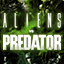
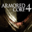
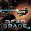
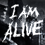
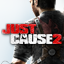
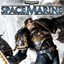

# List of games with optimized settings (188 games currently)

<h3>This repo is a port of A1eNaz's <a href="https://github.com/A1eNaz/Xenia-Game-Settings/wiki">Wiki of optimized settings</a></h3>

<table id="games-table" align="center"><thead><tr><th></th><th>Title Id</th><th>Title</th><th>Last Modified</th></tr></thead><tbody><tr><td></td><td>
<a href="https://github.com/xenia-manager/optimized-settings/blob/main/settings/5451083B.toml"><strong>5451083B</strong></a>
</td><td>
<strong>50 Cent BotS</strong>
</td><td>
<a href="https://github.com/xenia-manager/optimized-settings/commit/721f2385679ea07d2a9a80060c20401ce22de845">04/06/2026</a>
</td></tr><tr><td></td><td>
<a href="https://github.com/xenia-manager/optimized-settings/blob/main/settings/55530808.toml"><strong>55530808</strong></a>
</td><td>
<strong>AA True Soldiers</strong>
</td><td>
<a href="https://github.com/xenia-manager/optimized-settings/commit/721f2385679ea07d2a9a80060c20401ce22de845">04/06/2026</a>
</td></tr><tr><td></td><td>
<a href="https://github.com/xenia-manager/optimized-settings/blob/main/settings/4E4D07D1.toml"><strong>4E4D07D1</strong></a>
</td><td>
<strong>ACE COMBAT 6 Fires of Liberation</strong>
</td><td>
<a href="https://github.com/xenia-manager/optimized-settings/commit/ba12f27b2d34b6e1b8e0c79485b8453f7cdf08c1">23/04/2026</a>
</td></tr><tr><td></td><td>
<a href="https://github.com/xenia-manager/optimized-settings/blob/main/settings/58410A22.toml"><strong>58410A22</strong></a>
</td><td>
<strong>Alien Breed 2 Assault</strong>
</td><td>
<a href="https://github.com/xenia-manager/optimized-settings/commit/7b7e61cd00672fda6f7508f780208d5fdddd6834">28/06/2026</a>
</td></tr><tr><td></td><td>
<a href="https://github.com/xenia-manager/optimized-settings/blob/main/settings/58410AA3.toml"><strong>58410AA3</strong></a>
</td><td>
<strong>Alien Breed 3 Descent</strong>
</td><td>
<a href="https://github.com/xenia-manager/optimized-settings/commit/7b7e61cd00672fda6f7508f780208d5fdddd6834">28/06/2026</a>
</td></tr><tr><td></td><td>
<a href="https://github.com/xenia-manager/optimized-settings/blob/main/settings/58410964.toml"><strong>58410964</strong></a>
</td><td>
<strong>Alien Breed Episode 1</strong>
</td><td>
<a href="https://github.com/xenia-manager/optimized-settings/commit/7b7e61cd00672fda6f7508f780208d5fdddd6834">28/06/2026</a>
</td></tr><tr><td></td><td>
<a href="https://github.com/xenia-manager/optimized-settings/blob/main/settings/5345082A.toml"><strong>5345082A</strong></a>
</td><td>
<strong>Aliens vs Predator</strong>
</td><td>
<a href="https://github.com/xenia-manager/optimized-settings/commit/9030056e7a24404ed054f159a5e51a40900a212a">18/07/2026</a>
</td></tr><tr><td></td><td>
<a href="https://github.com/xenia-manager/optimized-settings/blob/main/settings/415607D4.toml"><strong>415607D4</strong></a>
</td><td>
<strong>American Wasteland</strong>
</td><td>
<a href="https://github.com/xenia-manager/optimized-settings/commit/9030056e7a24404ed054f159a5e51a40900a212a">18/07/2026</a>
</td></tr><tr><td></td><td>
<a href="https://github.com/xenia-manager/optimized-settings/blob/main/settings/58410991.toml"><strong>58410991</strong></a>
</td><td>
<strong>ARKANOID Live</strong>
</td><td>
<a href="https://github.com/xenia-manager/optimized-settings/commit/7b7e61cd00672fda6f7508f780208d5fdddd6834">28/06/2026</a>
</td></tr><tr><td></td><td>
<a href="https://github.com/xenia-manager/optimized-settings/blob/main/settings/4E4D084F.toml"><strong>4E4D084F</strong></a>
</td><td>
<strong>Armored Core V</strong>
</td><td>
<a href="https://github.com/xenia-manager/optimized-settings/commit/721f2385679ea07d2a9a80060c20401ce22de845">04/06/2026</a>
</td></tr><tr><td></td><td>
<a href="https://github.com/xenia-manager/optimized-settings/blob/main/settings/4E4D0864.toml"><strong>4E4D0864</strong></a>
</td><td>
<strong>ARMORED CORE VERDICT DAY</strong>
</td><td>
<a href="https://github.com/xenia-manager/optimized-settings/commit/721f2385679ea07d2a9a80060c20401ce22de845">04/06/2026</a>
</td></tr><tr><td></td><td>
<a href="https://github.com/xenia-manager/optimized-settings/blob/main/settings/465307D6.toml"><strong>465307D6</strong></a>
</td><td>
<strong>ARMORED CORE4</strong>
</td><td>
<a href="https://github.com/xenia-manager/optimized-settings/commit/721f2385679ea07d2a9a80060c20401ce22de845">04/06/2026</a>
</td></tr><tr><td></td><td>
<a href="https://github.com/xenia-manager/optimized-settings/blob/main/settings/454107F8.toml"><strong>454107F8</strong></a>
</td><td>
<strong>Army of Two</strong>
</td><td>
<a href="https://github.com/xenia-manager/optimized-settings/commit/721f2385679ea07d2a9a80060c20401ce22de845">04/06/2026</a>
</td></tr><tr><td></td><td>
<a href="https://github.com/xenia-manager/optimized-settings/blob/main/settings/454108D8.toml"><strong>454108D8</strong></a>
</td><td>
<strong>Army of TWO TFD</strong>
</td><td>
<a href="https://github.com/xenia-manager/optimized-settings/commit/721f2385679ea07d2a9a80060c20401ce22de845">04/06/2026</a>
</td></tr><tr><td></td><td>
<a href="https://github.com/xenia-manager/optimized-settings/blob/main/settings/555307D4.toml"><strong>555307D4</strong></a>
</td><td>
<strong>Assassins Creed</strong>
</td><td>
<a href="https://github.com/xenia-manager/optimized-settings/commit/33867041b8470b78844dc765c958ea40149e6f3c">28/06/2026</a>
</td></tr><tr><td></td><td>
<a href="https://github.com/xenia-manager/optimized-settings/blob/main/settings/5553085D.toml"><strong>5553085D</strong></a>
</td><td>
<strong>Assassins Creed Brotherhood</strong>
</td><td>
<a href="https://github.com/xenia-manager/optimized-settings/commit/7b7e61cd00672fda6f7508f780208d5fdddd6834">28/06/2026</a>
</td></tr><tr><td></td><td>
<a href="https://github.com/xenia-manager/optimized-settings/blob/main/settings/5553083B.toml"><strong>5553083B</strong></a>
</td><td>
<strong>Assassins Creed II</strong>
</td><td>
<a href="https://github.com/xenia-manager/optimized-settings/commit/33867041b8470b78844dc765c958ea40149e6f3c">28/06/2026</a>
</td></tr><tr><td></td><td>
<a href="https://github.com/xenia-manager/optimized-settings/blob/main/settings/555308AE.toml"><strong>555308AE</strong></a>
</td><td>
<strong>Assassins Creed III</strong>
</td><td>
<a href="https://github.com/xenia-manager/optimized-settings/commit/9030056e7a24404ed054f159a5e51a40900a212a">18/07/2026</a>
</td></tr><tr><td></td><td>
<a href="https://github.com/xenia-manager/optimized-settings/blob/main/settings/584113FC.toml"><strong>584113FC</strong></a>
</td><td>
<strong>Assassins Creed III Liberation HD</strong>
</td><td>
<a href="https://github.com/xenia-manager/optimized-settings/commit/7b7e61cd00672fda6f7508f780208d5fdddd6834">28/06/2026</a>
</td></tr><tr><td></td><td>
<a href="https://github.com/xenia-manager/optimized-settings/blob/main/settings/555308C2.toml"><strong>555308C2</strong></a>
</td><td>
<strong>Assassins CreedIV Black Flag</strong>
</td><td>
<a href="https://github.com/xenia-manager/optimized-settings/commit/9030056e7a24404ed054f159a5e51a40900a212a">18/07/2026</a>
</td></tr><tr><td></td><td>
<a href="https://github.com/xenia-manager/optimized-settings/blob/main/settings/494707EE.toml"><strong>494707EE</strong></a>
</td><td>
<strong>Assault on Dark Athena</strong>
</td><td>
<a href="https://github.com/xenia-manager/optimized-settings/commit/33867041b8470b78844dc765c958ea40149e6f3c">28/06/2026</a>
</td></tr><tr><td></td><td>
<a href="https://github.com/xenia-manager/optimized-settings/blob/main/settings/464F07DA.toml"><strong>464F07DA</strong></a>
</td><td>
<strong>BACKBREAKER</strong>
</td><td>
<a href="https://github.com/xenia-manager/optimized-settings/commit/e0df7df9f2ae5d995473d0d4ae343158b0dc250f">29/03/2026</a>
</td></tr><tr><td></td><td>
<a href="https://github.com/xenia-manager/optimized-settings/blob/main/settings/58410B39.toml"><strong>58410B39</strong></a>
</td><td>
<strong>Backbreaker Vengeance</strong>
</td><td>
<a href="https://github.com/xenia-manager/optimized-settings/commit/e0df7df9f2ae5d995473d0d4ae343158b0dc250f">29/03/2026</a>
</td></tr><tr><td></td><td>
<a href="https://github.com/xenia-manager/optimized-settings/blob/main/settings/41560857.toml"><strong>41560857</strong></a>
</td><td>
<strong>Bakugan</strong>
</td><td>
<a href="https://github.com/xenia-manager/optimized-settings/commit/e0df7df9f2ae5d995473d0d4ae343158b0dc250f">29/03/2026</a>
</td></tr><tr><td></td><td>
<a href="https://github.com/xenia-manager/optimized-settings/blob/main/settings/4D5307ED.toml"><strong>4D5307ED</strong></a>
</td><td>
<strong>Banjo Kazooie N and B</strong>
</td><td>
<a href="https://github.com/xenia-manager/optimized-settings/commit/721f2385679ea07d2a9a80060c20401ce22de845">04/06/2026</a>
</td></tr><tr><td></td><td>
<a href="https://github.com/xenia-manager/optimized-settings/blob/main/settings/57520802.toml"><strong>57520802</strong></a>
</td><td>
<strong>Batman Arkham City</strong>
</td><td>
<a href="https://github.com/xenia-manager/optimized-settings/commit/91678d2a6f419f04629f20d45a84d6eae863ac40">04/06/2026</a>
</td></tr><tr><td></td><td>
<a href="https://github.com/xenia-manager/optimized-settings/blob/main/settings/584114BB.toml"><strong>584114BB</strong></a>
</td><td>
<strong>Batman The Telltale Series</strong>
</td><td>
<a href="https://github.com/xenia-manager/optimized-settings/commit/7b7e61cd00672fda6f7508f780208d5fdddd6834">28/06/2026</a>
</td></tr><tr><td></td><td>
<a href="https://github.com/xenia-manager/optimized-settings/blob/main/settings/445007F1.toml"><strong>445007F1</strong></a>
</td><td>
<strong>Ben 10 Alien Force: Vilgax Attacks</strong>
</td><td>
<a href="https://github.com/xenia-manager/optimized-settings/commit/e0df7df9f2ae5d995473d0d4ae343158b0dc250f">29/03/2026</a>
</td></tr><tr><td></td><td>
<a href="https://github.com/xenia-manager/optimized-settings/blob/main/settings/5454085D.toml"><strong>5454085D</strong></a>
</td><td>
<strong>BioShock Infinite</strong>
</td><td>
<a href="https://github.com/xenia-manager/optimized-settings/commit/91678d2a6f419f04629f20d45a84d6eae863ac40">04/06/2026</a>
</td></tr><tr><td></td><td>
<a href="https://github.com/xenia-manager/optimized-settings/blob/main/settings/4D5307DF.toml"><strong>4D5307DF</strong></a>
</td><td>
<strong>Blue Dragon</strong>
</td><td>
<a href="https://github.com/xenia-manager/optimized-settings/commit/721f2385679ea07d2a9a80060c20401ce22de845">04/06/2026</a>
</td></tr><tr><td></td><td>
<a href="https://github.com/xenia-manager/optimized-settings/blob/main/settings/41560845.toml"><strong>41560845</strong></a>
</td><td>
<strong>Blur</strong>
</td><td>
<a href="https://github.com/xenia-manager/optimized-settings/commit/ba12f27b2d34b6e1b8e0c79485b8453f7cdf08c1">23/04/2026</a>
</td></tr><tr><td></td><td>
<a href="https://github.com/xenia-manager/optimized-settings/blob/main/settings/434D0839.toml"><strong>434D0839</strong></a>
</td><td>
<strong>Bodycount</strong>
</td><td>
<a href="https://github.com/xenia-manager/optimized-settings/commit/91678d2a6f419f04629f20d45a84d6eae863ac40">04/06/2026</a>
</td></tr><tr><td></td><td>
<a href="https://github.com/xenia-manager/optimized-settings/blob/main/settings/555307EA.toml"><strong>555307EA</strong></a>
</td><td>
<strong>Brothers in Arms - Hell's Highway</strong>
</td><td>
<a href="https://github.com/xenia-manager/optimized-settings/commit/9030056e7a24404ed054f159a5e51a40900a212a">18/07/2026</a>
</td></tr><tr><td></td><td>
<a href="https://github.com/xenia-manager/optimized-settings/blob/main/settings/415607E1.toml"><strong>415607E1</strong></a>
</td><td>
<strong>Call of Duty 3</strong>
</td><td>
<a href="https://github.com/xenia-manager/optimized-settings/commit/ba12f27b2d34b6e1b8e0c79485b8453f7cdf08c1">23/04/2026</a>
</td></tr><tr><td></td><td>
<a href="https://github.com/xenia-manager/optimized-settings/blob/main/settings/58410957.toml"><strong>58410957</strong></a>
</td><td>
<strong>Call of Duty Classic</strong>
</td><td>
<a href="https://github.com/xenia-manager/optimized-settings/commit/721f2385679ea07d2a9a80060c20401ce22de845">04/06/2026</a>
</td></tr><tr><td></td><td>
<a href="https://github.com/xenia-manager/optimized-settings/blob/main/settings/4156085A.toml"><strong>4156085A</strong></a>
</td><td>
<strong>Chaotic</strong>
</td><td>
<a href="https://github.com/xenia-manager/optimized-settings/commit/721f2385679ea07d2a9a80060c20401ce22de845">04/06/2026</a>
</td></tr><tr><td></td><td>
<a href="https://github.com/xenia-manager/optimized-settings/blob/main/settings/5553084C.toml"><strong>5553084C</strong></a>
</td><td>
<strong>Child of Eden</strong>
</td><td>
<a href="https://github.com/xenia-manager/optimized-settings/commit/e0df7df9f2ae5d995473d0d4ae343158b0dc250f">29/03/2026</a>
</td></tr><tr><td></td><td>
<a href="https://github.com/xenia-manager/optimized-settings/blob/main/settings/534507D4.toml"><strong>534507D4</strong></a>
</td><td>
<strong>Chromehounds</strong>
</td><td>
<a href="https://github.com/xenia-manager/optimized-settings/commit/e0df7df9f2ae5d995473d0d4ae343158b0dc250f">29/03/2026</a>
</td></tr><tr><td></td><td>
<a href="https://github.com/xenia-manager/optimized-settings/blob/main/settings/5841125A.toml"><strong>5841125A</strong></a>
</td><td>
<strong>Counter-Strike GO</strong>
</td><td>
<a href="https://github.com/xenia-manager/optimized-settings/commit/91678d2a6f419f04629f20d45a84d6eae863ac40">04/06/2026</a>
</td></tr><tr><td></td><td>
<a href="https://github.com/xenia-manager/optimized-settings/blob/main/settings/4D5307DC.toml"><strong>4D5307DC</strong></a>
</td><td>
<strong>Crackdown</strong>
</td><td>
<a href="https://github.com/xenia-manager/optimized-settings/commit/ba12f27b2d34b6e1b8e0c79485b8453f7cdf08c1">23/04/2026</a>
</td></tr><tr><td></td><td>
<a href="https://github.com/xenia-manager/optimized-settings/blob/main/settings/565507FA.toml"><strong>565507FA</strong></a>
</td><td>
<strong>Crash Mind Over Mutant</strong>
</td><td>
<a href="https://github.com/xenia-manager/optimized-settings/commit/721f2385679ea07d2a9a80060c20401ce22de845">04/06/2026</a>
</td></tr><tr><td></td><td>
<a href="https://github.com/xenia-manager/optimized-settings/blob/main/settings/565507E4.toml"><strong>565507E4</strong></a>
</td><td>
<strong>Crash Of The Titans</strong>
</td><td>
<a href="https://github.com/xenia-manager/optimized-settings/commit/721f2385679ea07d2a9a80060c20401ce22de845">04/06/2026</a>
</td></tr><tr><td></td><td>
<a href="https://github.com/xenia-manager/optimized-settings/blob/main/settings/424107DD.toml"><strong>424107DD</strong></a>
</td><td>
<strong>Culdcept SAGA</strong>
</td><td>
<a href="https://github.com/xenia-manager/optimized-settings/commit/e0df7df9f2ae5d995473d0d4ae343158b0dc250f">29/03/2026</a>
</td></tr><tr><td></td><td>
<a href="https://github.com/xenia-manager/optimized-settings/blob/main/settings/544307D1.toml"><strong>544307D1</strong></a>
</td><td>
<strong>DEAD OR ALIVE 4</strong>
</td><td>
<a href="https://github.com/xenia-manager/optimized-settings/commit/721f2385679ea07d2a9a80060c20401ce22de845">04/06/2026</a>
</td></tr><tr><td></td><td>
<a href="https://github.com/xenia-manager/optimized-settings/blob/main/settings/434307D2.toml"><strong>434307D2</strong></a>
</td><td>
<strong>DEAD RISING</strong>
</td><td>
<a href="https://github.com/xenia-manager/optimized-settings/commit/ba12f27b2d34b6e1b8e0c79485b8453f7cdf08c1">23/04/2026</a>
</td></tr><tr><td></td><td>
<a href="https://github.com/xenia-manager/optimized-settings/blob/main/settings/45410857.toml"><strong>45410857</strong></a>
</td><td>
<strong>Dead Space</strong>
</td><td>
<a href="https://github.com/xenia-manager/optimized-settings/commit/ba12f27b2d34b6e1b8e0c79485b8453f7cdf08c1">23/04/2026</a>
</td></tr><tr><td></td><td>
<a href="https://github.com/xenia-manager/optimized-settings/blob/main/settings/454108DF.toml"><strong>454108DF</strong></a>
</td><td>
<strong>Dead Space 2</strong>
</td><td>
<a href="https://github.com/xenia-manager/optimized-settings/commit/721f2385679ea07d2a9a80060c20401ce22de845">04/06/2026</a>
</td></tr><tr><td></td><td>
<a href="https://github.com/xenia-manager/optimized-settings/blob/main/settings/4541099D.toml"><strong>4541099D</strong></a>
</td><td>
<strong>Dead Space 3</strong>
</td><td>
<a href="https://github.com/xenia-manager/optimized-settings/commit/7cc4e69d6575d4affb55ada89217fc2e12febcf1">10/04/2026</a>
</td></tr><tr><td></td><td>
<a href="https://github.com/xenia-manager/optimized-settings/blob/main/settings/434D0819.toml"><strong>434D0819</strong></a>
</td><td>
<strong>DiRT 2</strong>
</td><td>
<a href="https://github.com/xenia-manager/optimized-settings/commit/33867041b8470b78844dc765c958ea40149e6f3c">28/06/2026</a>
</td></tr><tr><td></td><td>
<a href="https://github.com/xenia-manager/optimized-settings/blob/main/settings/425307E3.toml"><strong>425307E3</strong></a>
</td><td>
<strong>Dishonored</strong>
</td><td>
<a href="https://github.com/xenia-manager/optimized-settings/commit/91678d2a6f419f04629f20d45a84d6eae863ac40">04/06/2026</a>
</td></tr><tr><td></td><td>
<a href="https://github.com/xenia-manager/optimized-settings/blob/main/settings/42560816.toml"><strong>42560816</strong></a>
</td><td>
<strong>Disney Epic Mickey 2 The Power of Two</strong>
</td><td>
<a href="https://github.com/xenia-manager/optimized-settings/commit/91678d2a6f419f04629f20d45a84d6eae863ac40">04/06/2026</a>
</td></tr><tr><td></td><td>
<a href="https://github.com/xenia-manager/optimized-settings/blob/main/settings/5553087E.toml"><strong>5553087E</strong></a>
</td><td>
<strong>Driver San Francisco</strong>
</td><td>
<a href="https://github.com/xenia-manager/optimized-settings/commit/7cc4e69d6575d4affb55ada89217fc2e12febcf1">10/04/2026</a>
</td></tr><tr><td></td><td>
<a href="https://github.com/xenia-manager/optimized-settings/blob/main/settings/4E4D0800.toml"><strong>4E4D0800</strong></a>
</td><td>
<strong>DW GUNDAM 2</strong>
</td><td>
<a href="https://github.com/xenia-manager/optimized-settings/commit/e0df7df9f2ae5d995473d0d4ae343158b0dc250f">29/03/2026</a>
</td></tr><tr><td></td><td>
<a href="https://github.com/xenia-manager/optimized-settings/blob/main/settings/4B4F07FA.toml"><strong>4B4F07FA</strong></a>
</td><td>
<strong>DW Strikeforce</strong>
</td><td>
<a href="https://github.com/xenia-manager/optimized-settings/commit/e0df7df9f2ae5d995473d0d4ae343158b0dc250f">29/03/2026</a>
</td></tr><tr><td></td><td>
<a href="https://github.com/xenia-manager/optimized-settings/blob/main/settings/4E4D0834.toml"><strong>4E4D0834</strong></a>
</td><td>
<strong>Dynasty Warriors Gundam 3</strong>
</td><td>
<a href="https://github.com/xenia-manager/optimized-settings/commit/e0df7df9f2ae5d995473d0d4ae343158b0dc250f">29/03/2026</a>
</td></tr><tr><td></td><td>
<a href="https://github.com/xenia-manager/optimized-settings/blob/main/settings/4541097B.toml"><strong>4541097B</strong></a>
</td><td>
<strong>EA SPORTS FIFA Street</strong>
</td><td>
<a href="https://github.com/xenia-manager/optimized-settings/commit/721f2385679ea07d2a9a80060c20401ce22de845">04/06/2026</a>
</td></tr><tr><td></td><td>
<a href="https://github.com/xenia-manager/optimized-settings/blob/main/settings/454109EC.toml"><strong>454109EC</strong></a>
</td><td>
<strong>EA SPORTS NHL Legacy Edition</strong>
</td><td>
<a href="https://github.com/xenia-manager/optimized-settings/commit/e0df7df9f2ae5d995473d0d4ae343158b0dc250f">29/03/2026</a>
</td></tr><tr><td></td><td>
<a href="https://github.com/xenia-manager/optimized-settings/blob/main/settings/494F07D1.toml"><strong>494F07D1</strong></a>
</td><td>
<strong>El Shaddai  ASCENSION OF THE METATRON</strong>
</td><td>
<a href="https://github.com/xenia-manager/optimized-settings/commit/721f2385679ea07d2a9a80060c20401ce22de845">04/06/2026</a>
</td></tr><tr><td></td><td>
<a href="https://github.com/xenia-manager/optimized-settings/blob/main/settings/4E4D07E4.toml"><strong>4E4D07E4</strong></a>
</td><td>
<strong>Eternal Sonata</strong>
</td><td>
<a href="https://github.com/xenia-manager/optimized-settings/commit/e0df7df9f2ae5d995473d0d4ae343158b0dc250f">29/03/2026</a>
</td></tr><tr><td></td><td>
<a href="https://github.com/xenia-manager/optimized-settings/blob/main/settings/58410B86.toml"><strong>58410B86</strong></a>
</td><td>
<strong>Fable Heroes</strong>
</td><td>
<a href="https://github.com/xenia-manager/optimized-settings/commit/721f2385679ea07d2a9a80060c20401ce22de845">04/06/2026</a>
</td></tr><tr><td></td><td>
<a href="https://github.com/xenia-manager/optimized-settings/blob/main/settings/4D5307F1.toml"><strong>4D5307F1</strong></a>
</td><td>
<strong>FABLE II</strong>
</td><td>
<a href="https://github.com/xenia-manager/optimized-settings/commit/e0df7df9f2ae5d995473d0d4ae343158b0dc250f">29/03/2026</a>
</td></tr><tr><td></td><td>
<a href="https://github.com/xenia-manager/optimized-settings/blob/main/settings/4541083B.toml"><strong>4541083B</strong></a>
</td><td>
<strong>FIFA Street 3</strong>
</td><td>
<a href="https://github.com/xenia-manager/optimized-settings/commit/721f2385679ea07d2a9a80060c20401ce22de845">04/06/2026</a>
</td></tr><tr><td></td><td>
<a href="https://github.com/xenia-manager/optimized-settings/blob/main/settings/45410915.toml"><strong>45410915</strong></a>
</td><td>
<strong>FIGHT NIGHT CHAMPION</strong>
</td><td>
<a href="https://github.com/xenia-manager/optimized-settings/commit/721f2385679ea07d2a9a80060c20401ce22de845">04/06/2026</a>
</td></tr><tr><td></td><td>
<a href="https://github.com/xenia-manager/optimized-settings/blob/main/settings/4D5309C9.toml"><strong>4D5309C9</strong></a>
</td><td>
<strong>Forza Horizon</strong>
</td><td>
<a href="https://github.com/xenia-manager/optimized-settings/commit/721f2385679ea07d2a9a80060c20401ce22de845">04/06/2026</a>
</td></tr><tr><td></td><td>
<a href="https://github.com/xenia-manager/optimized-settings/blob/main/settings/4D530AA4.toml"><strong>4D530AA4</strong></a>
</td><td>
<strong>Forza Horizon 2</strong>
</td><td>
<a href="https://github.com/xenia-manager/optimized-settings/commit/721f2385679ea07d2a9a80060c20401ce22de845">04/06/2026</a>
</td></tr><tr><td></td><td>
<a href="https://github.com/xenia-manager/optimized-settings/blob/main/settings/4D5307EA.toml"><strong>4D5307EA</strong></a>
</td><td>
<strong>Forza Motorsport 2</strong>
</td><td>
<a href="https://github.com/xenia-manager/optimized-settings/commit/721f2385679ea07d2a9a80060c20401ce22de845">04/06/2026</a>
</td></tr><tr><td></td><td>
<a href="https://github.com/xenia-manager/optimized-settings/blob/main/settings/4D53084D.toml"><strong>4D53084D</strong></a>
</td><td>
<strong>Forza Motorsport 3</strong>
</td><td>
<a href="https://github.com/xenia-manager/optimized-settings/commit/721f2385679ea07d2a9a80060c20401ce22de845">04/06/2026</a>
</td></tr><tr><td></td><td>
<a href="https://github.com/xenia-manager/optimized-settings/blob/main/settings/4D530910.toml"><strong>4D530910</strong></a>
</td><td>
<strong>Forza Motorsport 4</strong>
</td><td>
<a href="https://github.com/xenia-manager/optimized-settings/commit/721f2385679ea07d2a9a80060c20401ce22de845">04/06/2026</a>
</td></tr><tr><td></td><td>
<a href="https://github.com/xenia-manager/optimized-settings/blob/main/settings/4C4107D4.toml"><strong>4C4107D4</strong></a>
</td><td>
<strong>Fracture</strong>
</td><td>
<a href="https://github.com/xenia-manager/optimized-settings/commit/e0df7df9f2ae5d995473d0d4ae343158b0dc250f">29/03/2026</a>
</td></tr><tr><td></td><td>
<a href="https://github.com/xenia-manager/optimized-settings/blob/main/settings/584111F9.toml"><strong>584111F9</strong></a>
</td><td>
<strong>Frogger Hyper Arcade Edition</strong>
</td><td>
<a href="https://github.com/xenia-manager/optimized-settings/commit/e0df7df9f2ae5d995473d0d4ae343158b0dc250f">29/03/2026</a>
</td></tr><tr><td></td><td>
<a href="https://github.com/xenia-manager/optimized-settings/blob/main/settings/4541096E.toml"><strong>4541096E</strong></a>
</td><td>
<strong>Fuse</strong>
</td><td>
<a href="https://github.com/xenia-manager/optimized-settings/commit/91678d2a6f419f04629f20d45a84d6eae863ac40">04/06/2026</a>
</td></tr><tr><td></td><td>
<a href="https://github.com/xenia-manager/optimized-settings/blob/main/settings/4D5307D5.toml"><strong>4D5307D5</strong></a>
</td><td>
<strong>Gears of War</strong>
</td><td>
<a href="https://github.com/xenia-manager/optimized-settings/commit/721f2385679ea07d2a9a80060c20401ce22de845">04/06/2026</a>
</td></tr><tr><td></td><td>
<a href="https://github.com/xenia-manager/optimized-settings/blob/main/settings/4D53082D.toml"><strong>4D53082D</strong></a>
</td><td>
<strong>Gears of War 2</strong>
</td><td>
<a href="https://github.com/xenia-manager/optimized-settings/commit/91678d2a6f419f04629f20d45a84d6eae863ac40">04/06/2026</a>
</td></tr><tr><td></td><td>
<a href="https://github.com/xenia-manager/optimized-settings/blob/main/settings/4D5308AB.toml"><strong>4D5308AB</strong></a>
</td><td>
<strong>Gears of War 3</strong>
</td><td>
<a href="https://github.com/xenia-manager/optimized-settings/commit/91678d2a6f419f04629f20d45a84d6eae863ac40">04/06/2026</a>
</td></tr><tr><td></td><td>
<a href="https://github.com/xenia-manager/optimized-settings/blob/main/settings/4D530A26.toml"><strong>4D530A26</strong></a>
</td><td>
<strong>Gears of War Judgment</strong>
</td><td>
<a href="https://github.com/xenia-manager/optimized-settings/commit/91678d2a6f419f04629f20d45a84d6eae863ac40">04/06/2026</a>
</td></tr><tr><td></td><td>
<a href="https://github.com/xenia-manager/optimized-settings/blob/main/settings/584113CF.toml"><strong>584113CF</strong></a>
</td><td>
<strong>God Mode</strong>
</td><td>
<a href="https://github.com/xenia-manager/optimized-settings/commit/91678d2a6f419f04629f20d45a84d6eae863ac40">04/06/2026</a>
</td></tr><tr><td></td><td>
<a href="https://github.com/xenia-manager/optimized-settings/blob/main/settings/415608AF.toml"><strong>415608AF</strong></a>
</td><td>
<strong>GoldenEye 007 Reloaded</strong>
</td><td>
<a href="https://github.com/xenia-manager/optimized-settings/commit/91678d2a6f419f04629f20d45a84d6eae863ac40">04/06/2026</a>
</td></tr><tr><td></td><td>
<a href="https://github.com/xenia-manager/optimized-settings/blob/main/settings/415688D0.toml"><strong>415688D0</strong></a>
</td><td>
<strong>GoldenEye 007 Reloaded</strong>
</td><td>
<a href="https://github.com/xenia-manager/optimized-settings/commit/91678d2a6f419f04629f20d45a84d6eae863ac40">04/06/2026</a>
</td></tr><tr><td></td><td>
<a href="https://github.com/xenia-manager/optimized-settings/blob/main/settings/545407F2.toml"><strong>545407F2</strong></a>
</td><td>
<strong>GTA IV</strong>
</td><td>
<a href="https://github.com/xenia-manager/optimized-settings/commit/721f2385679ea07d2a9a80060c20401ce22de845">04/06/2026</a>
</td></tr><tr><td></td><td>
<a href="https://github.com/xenia-manager/optimized-settings/blob/main/settings/424107D6.toml"><strong>424107D6</strong></a>
</td><td>
<strong>GUNDAM OPERATION TROY</strong>
</td><td>
<a href="https://github.com/xenia-manager/optimized-settings/commit/e0df7df9f2ae5d995473d0d4ae343158b0dc250f">29/03/2026</a>
</td></tr><tr><td></td><td>
<a href="https://github.com/xenia-manager/optimized-settings/blob/main/settings/4D5307E6.toml"><strong>4D5307E6</strong></a>
</td><td>
<strong>Halo 3</strong>
</td><td>
<a href="https://github.com/xenia-manager/optimized-settings/commit/e0df7df9f2ae5d995473d0d4ae343158b0dc250f">29/03/2026</a>
</td></tr><tr><td></td><td>
<a href="https://github.com/xenia-manager/optimized-settings/blob/main/settings/4D530877.toml"><strong>4D530877</strong></a>
</td><td>
<strong>Halo 3 ODST Campaign Edition</strong>
</td><td>
<a href="https://github.com/xenia-manager/optimized-settings/commit/33867041b8470b78844dc765c958ea40149e6f3c">28/06/2026</a>
</td></tr><tr><td></td><td>
<a href="https://github.com/xenia-manager/optimized-settings/blob/main/settings/4D530919.toml"><strong>4D530919</strong></a>
</td><td>
<strong>Halo 4</strong>
</td><td>
<a href="https://github.com/xenia-manager/optimized-settings/commit/721f2385679ea07d2a9a80060c20401ce22de845">04/06/2026</a>
</td></tr><tr><td></td><td>
<a href="https://github.com/xenia-manager/optimized-settings/blob/main/settings/4D5309B1.toml"><strong>4D5309B1</strong></a>
</td><td>
<strong>Halo Combat Evolved Anniversary</strong>
</td><td>
<a href="https://github.com/xenia-manager/optimized-settings/commit/91678d2a6f419f04629f20d45a84d6eae863ac40">04/06/2026</a>
</td></tr><tr><td></td><td>
<a href="https://github.com/xenia-manager/optimized-settings/blob/main/settings/4D53085B.toml"><strong>4D53085B</strong></a>
</td><td>
<strong>Halo Reach</strong>
</td><td>
<a href="https://github.com/xenia-manager/optimized-settings/commit/721f2385679ea07d2a9a80060c20401ce22de845">04/06/2026</a>
</td></tr><tr><td></td><td>
<a href="https://github.com/xenia-manager/optimized-settings/blob/main/settings/54510846.toml"><strong>54510846</strong></a>
</td><td>
<strong>Homefront</strong>
</td><td>
<a href="https://github.com/xenia-manager/optimized-settings/commit/91678d2a6f419f04629f20d45a84d6eae863ac40">04/06/2026</a>
</td></tr><tr><td></td><td>
<a href="https://github.com/xenia-manager/optimized-settings/blob/main/settings/5841096A.toml"><strong>5841096A</strong></a>
</td><td>
<strong>Hydro Thunder Hurricane</strong>
</td><td>
<a href="https://github.com/xenia-manager/optimized-settings/commit/721f2385679ea07d2a9a80060c20401ce22de845">04/06/2026</a>
</td></tr><tr><td></td><td>
<a href="https://github.com/xenia-manager/optimized-settings/blob/main/settings/58410B3A.toml"><strong>58410B3A</strong></a>
</td><td>
<strong>I Am Alive</strong>
</td><td>
<a href="https://github.com/xenia-manager/optimized-settings/commit/9030056e7a24404ed054f159a5e51a40900a212a">18/07/2026</a>
</td></tr><tr><td></td><td>
<a href="https://github.com/xenia-manager/optimized-settings/blob/main/settings/425407D1.toml"><strong>425407D1</strong></a>
</td><td>
<strong>Jumper</strong>
</td><td>
<a href="https://github.com/xenia-manager/optimized-settings/commit/e0df7df9f2ae5d995473d0d4ae343158b0dc250f">29/03/2026</a>
</td></tr><tr><td></td><td>
<a href="https://github.com/xenia-manager/optimized-settings/blob/main/settings/534307E7.toml"><strong>534307E7</strong></a>
</td><td>
<strong>Just Cause 2</strong>
</td><td>
<a href="https://github.com/xenia-manager/optimized-settings/commit/33867041b8470b78844dc765c958ea40149e6f3c">28/06/2026</a>
</td></tr><tr><td></td><td>
<a href="https://github.com/xenia-manager/optimized-settings/blob/main/settings/4D5307D2.toml"><strong>4D5307D2</strong></a>
</td><td>
<strong>Kameo</strong>
</td><td>
<a href="https://github.com/xenia-manager/optimized-settings/commit/91678d2a6f419f04629f20d45a84d6eae863ac40">04/06/2026</a>
</td></tr><tr><td></td><td>
<a href="https://github.com/xenia-manager/optimized-settings/blob/main/settings/534307EA.toml"><strong>534307EA</strong></a>
</td><td>
<strong>Lara Croft Tomb Raider Anniversary</strong>
</td><td>
<a href="https://github.com/xenia-manager/optimized-settings/commit/721f2385679ea07d2a9a80060c20401ce22de845">04/06/2026</a>
</td></tr><tr><td></td><td>
<a href="https://github.com/xenia-manager/optimized-settings/blob/main/settings/45410830.toml"><strong>45410830</strong></a>
</td><td>
<strong>Left 4 Dead</strong>
</td><td>
<a href="https://github.com/xenia-manager/optimized-settings/commit/33867041b8470b78844dc765c958ea40149e6f3c">28/06/2026</a>
</td></tr><tr><td></td><td>
<a href="https://github.com/xenia-manager/optimized-settings/blob/main/settings/454108D4.toml"><strong>454108D4</strong></a>
</td><td>
<strong>Left 4 Dead 2</strong>
</td><td>
<a href="https://github.com/xenia-manager/optimized-settings/commit/91678d2a6f419f04629f20d45a84d6eae863ac40">04/06/2026</a>
</td></tr><tr><td></td><td>
<a href="https://github.com/xenia-manager/optimized-settings/blob/main/settings/565507F9.toml"><strong>565507F9</strong></a>
</td><td>
<strong>Legend of Spyro</strong>
</td><td>
<a href="https://github.com/xenia-manager/optimized-settings/commit/e0df7df9f2ae5d995473d0d4ae343158b0dc250f">29/03/2026</a>
</td></tr><tr><td></td><td>
<a href="https://github.com/xenia-manager/optimized-settings/blob/main/settings/565707D0.toml"><strong>565707D0</strong></a>
</td><td>
<strong>Lollipop Chainsaw</strong>
</td><td>
<a href="https://github.com/xenia-manager/optimized-settings/commit/91678d2a6f419f04629f20d45a84d6eae863ac40">04/06/2026</a>
</td></tr><tr><td></td><td>
<a href="https://github.com/xenia-manager/optimized-settings/blob/main/settings/4D5307FA.toml"><strong>4D5307FA</strong></a>
</td><td>
<strong>Lost Odyssey</strong>
</td><td>
<a href="https://github.com/xenia-manager/optimized-settings/commit/7b7e61cd00672fda6f7508f780208d5fdddd6834">28/06/2026</a>
</td></tr><tr><td></td><td>
<a href="https://github.com/xenia-manager/optimized-settings/blob/main/settings/5553080F.toml"><strong>5553080F</strong></a>
</td><td>
<strong>Lost Via Domus</strong>
</td><td>
<a href="https://github.com/xenia-manager/optimized-settings/commit/7b7e61cd00672fda6f7508f780208d5fdddd6834">28/06/2026</a>
</td></tr><tr><td></td><td>
<a href="https://github.com/xenia-manager/optimized-settings/blob/main/settings/454109C1.toml"><strong>454109C1</strong></a>
</td><td>
<strong>Madden NFL 25</strong>
</td><td>
<a href="https://github.com/xenia-manager/optimized-settings/commit/721f2385679ea07d2a9a80060c20401ce22de845">04/06/2026</a>
</td></tr><tr><td></td><td>
<a href="https://github.com/xenia-manager/optimized-settings/blob/main/settings/4E4D080B.toml"><strong>4E4D080B</strong></a>
</td><td>
<strong>Magnacarta2</strong>
</td><td>
<a href="https://github.com/xenia-manager/optimized-settings/commit/e0df7df9f2ae5d995473d0d4ae343158b0dc250f">29/03/2026</a>
</td></tr><tr><td></td><td>
<a href="https://github.com/xenia-manager/optimized-settings/blob/main/settings/4D5307E8.toml"><strong>4D5307E8</strong></a>
</td><td>
<strong>Mass Effect</strong>
</td><td>
<a href="https://github.com/xenia-manager/optimized-settings/commit/91678d2a6f419f04629f20d45a84d6eae863ac40">04/06/2026</a>
</td></tr><tr><td></td><td>
<a href="https://github.com/xenia-manager/optimized-settings/blob/main/settings/454108CE.toml"><strong>454108CE</strong></a>
</td><td>
<strong>Mass Effect 2</strong>
</td><td>
<a href="https://github.com/xenia-manager/optimized-settings/commit/91678d2a6f419f04629f20d45a84d6eae863ac40">04/06/2026</a>
</td></tr><tr><td></td><td>
<a href="https://github.com/xenia-manager/optimized-settings/blob/main/settings/4541095D.toml"><strong>4541095D</strong></a>
</td><td>
<strong>Mass Effect 3</strong>
</td><td>
<a href="https://github.com/xenia-manager/optimized-settings/commit/91678d2a6f419f04629f20d45a84d6eae863ac40">04/06/2026</a>
</td></tr><tr><td></td><td>
<a href="https://github.com/xenia-manager/optimized-settings/blob/main/settings/4B4E0840.toml"><strong>4B4E0840</strong></a>
</td><td>
<strong>Metal Gear Solid HD Collection</strong>
</td><td>
<a href="https://github.com/xenia-manager/optimized-settings/commit/721f2385679ea07d2a9a80060c20401ce22de845">04/06/2026</a>
</td></tr><tr><td></td><td>
<a href="https://github.com/xenia-manager/optimized-settings/blob/main/settings/4B4E085C.toml"><strong>4B4E085C</strong></a>
</td><td>
<strong>METAL GEAR SOLID V GROUND ZEROES</strong>
</td><td>
<a href="https://github.com/xenia-manager/optimized-settings/commit/7cc4e69d6575d4affb55ada89217fc2e12febcf1">10/04/2026</a>
</td></tr><tr><td></td><td>
<a href="https://github.com/xenia-manager/optimized-settings/blob/main/settings/54510842.toml"><strong>54510842</strong></a>
</td><td>
<strong>Metro 2033</strong>
</td><td>
<a href="https://github.com/xenia-manager/optimized-settings/commit/91678d2a6f419f04629f20d45a84d6eae863ac40">04/06/2026</a>
</td></tr><tr><td></td><td>
<a href="https://github.com/xenia-manager/optimized-settings/blob/main/settings/4B4D07F5.toml"><strong>4B4D07F5</strong></a>
</td><td>
<strong>Metro Last Light</strong>
</td><td>
<a href="https://github.com/xenia-manager/optimized-settings/commit/91678d2a6f419f04629f20d45a84d6eae863ac40">04/06/2026</a>
</td></tr><tr><td></td><td>
<a href="https://github.com/xenia-manager/optimized-settings/blob/main/settings/545407F8.toml"><strong>545407F8</strong></a>
</td><td>
<strong>Midnight Club Los Angeles Complete</strong>
</td><td>
<a href="https://github.com/xenia-manager/optimized-settings/commit/721f2385679ea07d2a9a80060c20401ce22de845">04/06/2026</a>
</td></tr><tr><td></td><td>
<a href="https://github.com/xenia-manager/optimized-settings/blob/main/settings/584111F7.toml"><strong>584111F7</strong></a>
</td><td>
<strong>Minecraft Xbox 360 Edition</strong>
</td><td>
<a href="https://github.com/xenia-manager/optimized-settings/commit/721f2385679ea07d2a9a80060c20401ce22de845">04/06/2026</a>
</td></tr><tr><td></td><td>
<a href="https://github.com/xenia-manager/optimized-settings/blob/main/settings/45410850.toml"><strong>45410850</strong></a>
</td><td>
<strong>Mirrors Edge</strong>
</td><td>
<a href="https://github.com/xenia-manager/optimized-settings/commit/91678d2a6f419f04629f20d45a84d6eae863ac40">04/06/2026</a>
</td></tr><tr><td></td><td>
<a href="https://github.com/xenia-manager/optimized-settings/blob/main/settings/58410837.toml"><strong>58410837</strong></a>
</td><td>
<strong>Ms. Pac-Man</strong>
</td><td>
<a href="https://github.com/xenia-manager/optimized-settings/commit/3079856c1b14acd89fd6cfba29089d66e4509141">08/06/2026</a>
</td></tr><tr><td></td><td>
<a href="https://github.com/xenia-manager/optimized-settings/blob/main/settings/5451087B.toml"><strong>5451087B</strong></a>
</td><td>
<strong>MX vs ATV Alive</strong>
</td><td>
<a href="https://github.com/xenia-manager/optimized-settings/commit/91678d2a6f419f04629f20d45a84d6eae863ac40">04/06/2026</a>
</td></tr><tr><td></td><td>
<a href="https://github.com/xenia-manager/optimized-settings/blob/main/settings/555307E5.toml"><strong>555307E5</strong></a>
</td><td>
<strong>Naruto Rise Of A Ninja</strong>
</td><td>
<a href="https://github.com/xenia-manager/optimized-settings/commit/ba12f27b2d34b6e1b8e0c79485b8453f7cdf08c1">23/04/2026</a>
</td></tr><tr><td></td><td>
<a href="https://github.com/xenia-manager/optimized-settings/blob/main/settings/55530825.toml"><strong>55530825</strong></a>
</td><td>
<strong>Naruto The Broken Bond</strong>
</td><td>
<a href="https://github.com/xenia-manager/optimized-settings/commit/ba12f27b2d34b6e1b8e0c79485b8453f7cdf08c1">23/04/2026</a>
</td></tr><tr><td></td><td>
<a href="https://github.com/xenia-manager/optimized-settings/blob/main/settings/45410845.toml"><strong>45410845</strong></a>
</td><td>
<strong>NASCAR 09</strong>
</td><td>
<a href="https://github.com/xenia-manager/optimized-settings/commit/e0df7df9f2ae5d995473d0d4ae343158b0dc250f">29/03/2026</a>
</td></tr><tr><td></td><td>
<a href="https://github.com/xenia-manager/optimized-settings/blob/main/settings/4F4807D1.toml"><strong>4F4807D1</strong></a>
</td><td>
<strong>NASCAR 15 Victory Edition</strong>
</td><td>
<a href="https://github.com/xenia-manager/optimized-settings/commit/721f2385679ea07d2a9a80060c20401ce22de845">04/06/2026</a>
</td></tr><tr><td></td><td>
<a href="https://github.com/xenia-manager/optimized-settings/blob/main/settings/41560893.toml"><strong>41560893</strong></a>
</td><td>
<strong>NASCAR 2011: The Game</strong>
</td><td>
<a href="https://github.com/xenia-manager/optimized-settings/commit/721f2385679ea07d2a9a80060c20401ce22de845">04/06/2026</a>
</td></tr><tr><td></td><td>
<a href="https://github.com/xenia-manager/optimized-settings/blob/main/settings/415608D2.toml"><strong>415608D2</strong></a>
</td><td>
<strong>NASCAR Inside Line</strong>
</td><td>
<a href="https://github.com/xenia-manager/optimized-settings/commit/721f2385679ea07d2a9a80060c20401ce22de845">04/06/2026</a>
</td></tr><tr><td></td><td>
<a href="https://github.com/xenia-manager/optimized-settings/blob/main/settings/45410919.toml"><strong>45410919</strong></a>
</td><td>
<strong>NBA ELITE 11</strong>
</td><td>
<a href="https://github.com/xenia-manager/optimized-settings/commit/ba12f27b2d34b6e1b8e0c79485b8453f7cdf08c1">23/04/2026</a>
</td></tr><tr><td></td><td>
<a href="https://github.com/xenia-manager/optimized-settings/blob/main/settings/454107F1.toml"><strong>454107F1</strong></a>
</td><td>
<strong>NBA LIVE 07</strong>
</td><td>
<a href="https://github.com/xenia-manager/optimized-settings/commit/e0df7df9f2ae5d995473d0d4ae343158b0dc250f">29/03/2026</a>
</td></tr><tr><td></td><td>
<a href="https://github.com/xenia-manager/optimized-settings/blob/main/settings/4541082B.toml"><strong>4541082B</strong></a>
</td><td>
<strong>NBA LIVE 08</strong>
</td><td>
<a href="https://github.com/xenia-manager/optimized-settings/commit/e0df7df9f2ae5d995473d0d4ae343158b0dc250f">29/03/2026</a>
</td></tr><tr><td></td><td>
<a href="https://github.com/xenia-manager/optimized-settings/blob/main/settings/454107F7.toml"><strong>454107F7</strong></a>
</td><td>
<strong>NBA STREET Homecourt</strong>
</td><td>
<a href="https://github.com/xenia-manager/optimized-settings/commit/721f2385679ea07d2a9a80060c20401ce22de845">04/06/2026</a>
</td></tr><tr><td></td><td>
<a href="https://github.com/xenia-manager/optimized-settings/blob/main/settings/454109B6.toml"><strong>454109B6</strong></a>
</td><td>
<strong>NCAA Football 14</strong>
</td><td>
<a href="https://github.com/xenia-manager/optimized-settings/commit/ba12f27b2d34b6e1b8e0c79485b8453f7cdf08c1">23/04/2026</a>
</td></tr><tr><td></td><td>
<a href="https://github.com/xenia-manager/optimized-settings/blob/main/settings/454107F2.toml"><strong>454107F2</strong></a>
</td><td>
<strong>NCAA March Madness07</strong>
</td><td>
<a href="https://github.com/xenia-manager/optimized-settings/commit/e0df7df9f2ae5d995473d0d4ae343158b0dc250f">29/03/2026</a>
</td></tr><tr><td></td><td>
<a href="https://github.com/xenia-manager/optimized-settings/blob/main/settings/454107EC.toml"><strong>454107EC</strong></a>
</td><td>
<strong>Need for Speed Carbon</strong>
</td><td>
<a href="https://github.com/xenia-manager/optimized-settings/commit/ba12f27b2d34b6e1b8e0c79485b8453f7cdf08c1">23/04/2026</a>
</td></tr><tr><td></td><td>
<a href="https://github.com/xenia-manager/optimized-settings/blob/main/settings/4B4E081F.toml"><strong>4B4E081F</strong></a>
</td><td>
<strong>NeverDead</strong>
</td><td>
<a href="https://github.com/xenia-manager/optimized-settings/commit/e0df7df9f2ae5d995473d0d4ae343158b0dc250f">29/03/2026</a>
</td></tr><tr><td></td><td>
<a href="https://github.com/xenia-manager/optimized-settings/blob/main/settings/45410820.toml"><strong>45410820</strong></a>
</td><td>
<strong>NHL 08</strong>
</td><td>
<a href="https://github.com/xenia-manager/optimized-settings/commit/e0df7df9f2ae5d995473d0d4ae343158b0dc250f">29/03/2026</a>
</td></tr><tr><td></td><td>
<a href="https://github.com/xenia-manager/optimized-settings/blob/main/settings/45410872.toml"><strong>45410872</strong></a>
</td><td>
<strong>NHL 09</strong>
</td><td>
<a href="https://github.com/xenia-manager/optimized-settings/commit/e0df7df9f2ae5d995473d0d4ae343158b0dc250f">29/03/2026</a>
</td></tr><tr><td></td><td>
<a href="https://github.com/xenia-manager/optimized-settings/blob/main/settings/454108BA.toml"><strong>454108BA</strong></a>
</td><td>
<strong>NHL 10</strong>
</td><td>
<a href="https://github.com/xenia-manager/optimized-settings/commit/ba12f27b2d34b6e1b8e0c79485b8453f7cdf08c1">23/04/2026</a>
</td></tr><tr><td></td><td>
<a href="https://github.com/xenia-manager/optimized-settings/blob/main/settings/454108FD.toml"><strong>454108FD</strong></a>
</td><td>
<strong>NHL 11</strong>
</td><td>
<a href="https://github.com/xenia-manager/optimized-settings/commit/ba12f27b2d34b6e1b8e0c79485b8453f7cdf08c1">23/04/2026</a>
</td></tr><tr><td></td><td>
<a href="https://github.com/xenia-manager/optimized-settings/blob/main/settings/45410964.toml"><strong>45410964</strong></a>
</td><td>
<strong>NHL12</strong>
</td><td>
<a href="https://github.com/xenia-manager/optimized-settings/commit/ba12f27b2d34b6e1b8e0c79485b8453f7cdf08c1">23/04/2026</a>
</td></tr><tr><td></td><td>
<a href="https://github.com/xenia-manager/optimized-settings/blob/main/settings/454109BE.toml"><strong>454109BE</strong></a>
</td><td>
<strong>NHL14</strong>
</td><td>
<a href="https://github.com/xenia-manager/optimized-settings/commit/ba12f27b2d34b6e1b8e0c79485b8453f7cdf08c1">23/04/2026</a>
</td></tr><tr><td></td><td>
<a href="https://github.com/xenia-manager/optimized-settings/blob/main/settings/4D5307DB.toml"><strong>4D5307DB</strong></a>
</td><td>
<strong>Ninety-Nine Nights</strong>
</td><td>
<a href="https://github.com/xenia-manager/optimized-settings/commit/e0df7df9f2ae5d995473d0d4ae343158b0dc250f">29/03/2026</a>
</td></tr><tr><td></td><td>
<a href="https://github.com/xenia-manager/optimized-settings/blob/main/settings/4B4E0810.toml"><strong>4B4E0810</strong></a>
</td><td>
<strong>Ninety-Nine Nights II</strong>
</td><td>
<a href="https://github.com/xenia-manager/optimized-settings/commit/e0df7df9f2ae5d995473d0d4ae343158b0dc250f">29/03/2026</a>
</td></tr><tr><td></td><td>
<a href="https://github.com/xenia-manager/optimized-settings/blob/main/settings/544307D5.toml"><strong>544307D5</strong></a>
</td><td>
<strong>NINJA GAIDEN II</strong>
</td><td>
<a href="https://github.com/xenia-manager/optimized-settings/commit/9030056e7a24404ed054f159a5e51a40900a212a">18/07/2026</a>
</td></tr><tr><td></td><td>
<a href="https://github.com/xenia-manager/optimized-settings/blob/main/settings/415407D2.toml"><strong>415407D2</strong></a>
</td><td>
<strong>Operation Darkness</strong>
</td><td>
<a href="https://github.com/xenia-manager/optimized-settings/commit/e0df7df9f2ae5d995473d0d4ae343158b0dc250f">29/03/2026</a>
</td></tr><tr><td></td><td>
<a href="https://github.com/xenia-manager/optimized-settings/blob/main/settings/58410811.toml"><strong>58410811</strong></a>
</td><td>
<strong>PAC-MAN</strong>
</td><td>
<a href="https://github.com/xenia-manager/optimized-settings/commit/58a0264d6ec0066c28aa08e711146cd09738ee01">10/05/2026</a>
</td></tr><tr><td></td><td>
<a href="https://github.com/xenia-manager/optimized-settings/blob/main/settings/584109B4.toml"><strong>584109B4</strong></a>
</td><td>
<strong>Panzer General Allied Assault</strong>
</td><td>
<a href="https://github.com/xenia-manager/optimized-settings/commit/e0df7df9f2ae5d995473d0d4ae343158b0dc250f">29/03/2026</a>
</td></tr><tr><td></td><td>
<a href="https://github.com/xenia-manager/optimized-settings/blob/main/settings/4D5307D3.toml"><strong>4D5307D3</strong></a>
</td><td>
<strong>Perfect Dark Zero</strong>
</td><td>
<a href="https://github.com/xenia-manager/optimized-settings/commit/ba12f27b2d34b6e1b8e0c79485b8453f7cdf08c1">23/04/2026</a>
</td></tr><tr><td></td><td>
<a href="https://github.com/xenia-manager/optimized-settings/blob/main/settings/4D5307D1.toml"><strong>4D5307D1</strong></a>
</td><td>
<strong>PGR 3</strong>
</td><td>
<a href="https://github.com/xenia-manager/optimized-settings/commit/721f2385679ea07d2a9a80060c20401ce22de845">04/06/2026</a>
</td></tr><tr><td></td><td>
<a href="https://github.com/xenia-manager/optimized-settings/blob/main/settings/4D5307F9.toml"><strong>4D5307F9</strong></a>
</td><td>
<strong>PGR 4</strong>
</td><td>
<a href="https://github.com/xenia-manager/optimized-settings/commit/721f2385679ea07d2a9a80060c20401ce22de845">04/06/2026</a>
</td></tr><tr><td></td><td>
<a href="https://github.com/xenia-manager/optimized-settings/blob/main/settings/45410912.toml"><strong>45410912</strong></a>
</td><td>
<strong>Portal 2</strong>
</td><td>
<a href="https://github.com/xenia-manager/optimized-settings/commit/91678d2a6f419f04629f20d45a84d6eae863ac40">04/06/2026</a>
</td></tr><tr><td></td><td>
<a href="https://github.com/xenia-manager/optimized-settings/blob/main/settings/58410960.toml"><strong>58410960</strong></a>
</td><td>
<strong>Portal Still Alive</strong>
</td><td>
<a href="https://github.com/xenia-manager/optimized-settings/commit/91678d2a6f419f04629f20d45a84d6eae863ac40">04/06/2026</a>
</td></tr><tr><td></td><td>
<a href="https://github.com/xenia-manager/optimized-settings/blob/main/settings/544307DC.toml"><strong>544307DC</strong></a>
</td><td>
<strong>QUANTUM THEORY</strong>
</td><td>
<a href="https://github.com/xenia-manager/optimized-settings/commit/721f2385679ea07d2a9a80060c20401ce22de845">04/06/2026</a>
</td></tr><tr><td></td><td>
<a href="https://github.com/xenia-manager/optimized-settings/blob/main/settings/584111E0.toml"><strong>584111E0</strong></a>
</td><td>
<strong>REAL STEEL</strong>
</td><td>
<a href="https://github.com/xenia-manager/optimized-settings/commit/e0df7df9f2ae5d995473d0d4ae343158b0dc250f">29/03/2026</a>
</td></tr><tr><td></td><td>
<a href="https://github.com/xenia-manager/optimized-settings/blob/main/settings/5454082B.toml"><strong>5454082B</strong></a>
</td><td>
<strong>Red Dead Redemption</strong>
</td><td>
<a href="https://github.com/xenia-manager/optimized-settings/commit/721f2385679ea07d2a9a80060c20401ce22de845">04/06/2026</a>
</td></tr><tr><td></td><td>
<a href="https://github.com/xenia-manager/optimized-settings/blob/main/settings/5451080D.toml"><strong>5451080D</strong></a>
</td><td>
<strong>Red Faction Guerrilla</strong>
</td><td>
<a href="https://github.com/xenia-manager/optimized-settings/commit/9030056e7a24404ed054f159a5e51a40900a212a">18/07/2026</a>
</td></tr><tr><td></td><td>
<a href="https://github.com/xenia-manager/optimized-settings/blob/main/settings/4E4D07D3.toml"><strong>4E4D07D3</strong></a>
</td><td>
<strong>Ridge Racer 6</strong>
</td><td>
<a href="https://github.com/xenia-manager/optimized-settings/commit/e0df7df9f2ae5d995473d0d4ae343158b0dc250f">29/03/2026</a>
</td></tr><tr><td></td><td>
<a href="https://github.com/xenia-manager/optimized-settings/blob/main/settings/545107D1.toml"><strong>545107D1</strong></a>
</td><td>
<strong>Saints Row</strong>
</td><td>
<a href="https://github.com/xenia-manager/optimized-settings/commit/721f2385679ea07d2a9a80060c20401ce22de845">04/06/2026</a>
</td></tr><tr><td></td><td>
<a href="https://github.com/xenia-manager/optimized-settings/blob/main/settings/545107FC.toml"><strong>545107FC</strong></a>
</td><td>
<strong>Saints Row 2</strong>
</td><td>
<a href="https://github.com/xenia-manager/optimized-settings/commit/91678d2a6f419f04629f20d45a84d6eae863ac40">04/06/2026</a>
</td></tr><tr><td></td><td>
<a href="https://github.com/xenia-manager/optimized-settings/blob/main/settings/4B4E0802.toml"><strong>4B4E0802</strong></a>
</td><td>
<strong>Saw</strong>
</td><td>
<a href="https://github.com/xenia-manager/optimized-settings/commit/e0df7df9f2ae5d995473d0d4ae343158b0dc250f">29/03/2026</a>
</td></tr><tr><td></td><td>
<a href="https://github.com/xenia-manager/optimized-settings/blob/main/settings/4B4E0822.toml"><strong>4B4E0822</strong></a>
</td><td>
<strong>SAW II Flesh  Blood</strong>
</td><td>
<a href="https://github.com/xenia-manager/optimized-settings/commit/e0df7df9f2ae5d995473d0d4ae343158b0dc250f">29/03/2026</a>
</td></tr><tr><td></td><td>
<a href="https://github.com/xenia-manager/optimized-settings/blob/main/settings/475007D4.toml"><strong>475007D4</strong></a>
</td><td>
<strong>Section 8</strong>
</td><td>
<a href="https://github.com/xenia-manager/optimized-settings/commit/91678d2a6f419f04629f20d45a84d6eae863ac40">04/06/2026</a>
</td></tr><tr><td></td><td>
<a href="https://github.com/xenia-manager/optimized-settings/blob/main/settings/534507F5.toml"><strong>534507F5</strong></a>
</td><td>
<strong>SEGA Superstars Tennis</strong>
</td><td>
<a href="https://github.com/xenia-manager/optimized-settings/commit/ba12f27b2d34b6e1b8e0c79485b8453f7cdf08c1">23/04/2026</a>
</td></tr><tr><td></td><td>
<a href="https://github.com/xenia-manager/optimized-settings/blob/main/settings/54540845.toml"><strong>54540845</strong></a>
</td><td>
<strong>Sid Meiers Civilization Revolution</strong>
</td><td>
<a href="https://github.com/xenia-manager/optimized-settings/commit/e0df7df9f2ae5d995473d0d4ae343158b0dc250f">29/03/2026</a>
</td></tr><tr><td></td><td>
<a href="https://github.com/xenia-manager/optimized-settings/blob/main/settings/4B4E0823.toml"><strong>4B4E0823</strong></a>
</td><td>
<strong>Silent Hill  Downpour</strong>
</td><td>
<a href="https://github.com/xenia-manager/optimized-settings/commit/73494bf534f34e97d13a86d4481244ac545a6c60">06/04/2026</a>
</td></tr><tr><td></td><td>
<a href="https://github.com/xenia-manager/optimized-settings/blob/main/settings/45410813.toml"><strong>45410813</strong></a>
</td><td>
<strong>skate</strong>
</td><td>
<a href="https://github.com/xenia-manager/optimized-settings/commit/721f2385679ea07d2a9a80060c20401ce22de845">04/06/2026</a>
</td></tr><tr><td></td><td>
<a href="https://github.com/xenia-manager/optimized-settings/blob/main/settings/4541087F.toml"><strong>4541087F</strong></a>
</td><td>
<strong>Skate 2</strong>
</td><td>
<a href="https://github.com/xenia-manager/optimized-settings/commit/721f2385679ea07d2a9a80060c20401ce22de845">04/06/2026</a>
</td></tr><tr><td></td><td>
<a href="https://github.com/xenia-manager/optimized-settings/blob/main/settings/454108E6.toml"><strong>454108E6</strong></a>
</td><td>
<strong>Skate 3</strong>
</td><td>
<a href="https://github.com/xenia-manager/optimized-settings/commit/721f2385679ea07d2a9a80060c20401ce22de845">04/06/2026</a>
</td></tr><tr><td></td><td>
<a href="https://github.com/xenia-manager/optimized-settings/blob/main/settings/584109B5.toml"><strong>584109B5</strong></a>
</td><td>
<strong>Snoopy Flying Ace</strong>
</td><td>
<a href="https://github.com/xenia-manager/optimized-settings/commit/ba12f27b2d34b6e1b8e0c79485b8453f7cdf08c1">23/04/2026</a>
</td></tr><tr><td></td><td>
<a href="https://github.com/xenia-manager/optimized-settings/blob/main/settings/58411202.toml"><strong>58411202</strong></a>
</td><td>
<strong>Sonic Adventure 2</strong>
</td><td>
<a href="https://github.com/xenia-manager/optimized-settings/commit/33867041b8470b78844dc765c958ea40149e6f3c">28/06/2026</a>
</td></tr><tr><td></td><td>
<a href="https://github.com/xenia-manager/optimized-settings/blob/main/settings/5345084D.toml"><strong>5345084D</strong></a>
</td><td>
<strong>SONIC FREE RIDERS</strong>
</td><td>
<a href="https://github.com/xenia-manager/optimized-settings/commit/721f2385679ea07d2a9a80060c20401ce22de845">04/06/2026</a>
</td></tr><tr><td></td><td>
<a href="https://github.com/xenia-manager/optimized-settings/blob/main/settings/53450812.toml"><strong>53450812</strong></a>
</td><td>
<strong>SONIC UNLEASHED</strong>
</td><td>
<a href="https://github.com/xenia-manager/optimized-settings/commit/721f2385679ea07d2a9a80060c20401ce22de845">04/06/2026</a>
</td></tr><tr><td></td><td>
<a href="https://github.com/xenia-manager/optimized-settings/blob/main/settings/58411411.toml"><strong>58411411</strong></a>
</td><td>
<strong>SOULCALIBURII HD ONLINE</strong>
</td><td>
<a href="https://github.com/xenia-manager/optimized-settings/commit/91678d2a6f419f04629f20d45a84d6eae863ac40">04/06/2026</a>
</td></tr><tr><td></td><td>
<a href="https://github.com/xenia-manager/optimized-settings/blob/main/settings/4541096D.toml"><strong>4541096D</strong></a>
</td><td>
<strong>SSX</strong>
</td><td>
<a href="https://github.com/xenia-manager/optimized-settings/commit/e0df7df9f2ae5d995473d0d4ae343158b0dc250f">29/03/2026</a>
</td></tr><tr><td></td><td>
<a href="https://github.com/xenia-manager/optimized-settings/blob/main/settings/4E4D085B.toml"><strong>4E4D085B</strong></a>
</td><td>
<strong>Star Trek</strong>
</td><td>
<a href="https://github.com/xenia-manager/optimized-settings/commit/91678d2a6f419f04629f20d45a84d6eae863ac40">04/06/2026</a>
</td></tr><tr><td></td><td>
<a href="https://github.com/xenia-manager/optimized-settings/blob/main/settings/555307D7.toml"><strong>555307D7</strong></a>
</td><td>
<strong>TCs SC Double Agent</strong>
</td><td>
<a href="https://github.com/xenia-manager/optimized-settings/commit/721f2385679ea07d2a9a80060c20401ce22de845">04/06/2026</a>
</td></tr><tr><td></td><td>
<a href="https://github.com/xenia-manager/optimized-settings/blob/main/settings/415608FD.toml"><strong>415608FD</strong></a>
</td><td>
<strong>Teenage Mutant Ninja Turtles</strong>
</td><td>
<a href="https://github.com/xenia-manager/optimized-settings/commit/e0df7df9f2ae5d995473d0d4ae343158b0dc250f">29/03/2026</a>
</td></tr><tr><td></td><td>
<a href="https://github.com/xenia-manager/optimized-settings/blob/main/settings/4E4D0859.toml"><strong>4E4D0859</strong></a>
</td><td>
<strong>TEKKEN TAG TOURNAMENT 2</strong>
</td><td>
<a href="https://github.com/xenia-manager/optimized-settings/commit/721f2385679ea07d2a9a80060c20401ce22de845">04/06/2026</a>
</td></tr><tr><td></td><td>
<a href="https://github.com/xenia-manager/optimized-settings/blob/main/settings/465307D7.toml"><strong>465307D7</strong></a>
</td><td>
<strong>Tenchu Z</strong>
</td><td>
<a href="https://github.com/xenia-manager/optimized-settings/commit/e0df7df9f2ae5d995473d0d4ae343158b0dc250f">29/03/2026</a>
</td></tr><tr><td></td><td>
<a href="https://github.com/xenia-manager/optimized-settings/blob/main/settings/545407EE.toml"><strong>545407EE</strong></a>
</td><td>
<strong>The Darkness</strong>
</td><td>
<a href="https://github.com/xenia-manager/optimized-settings/commit/721f2385679ea07d2a9a80060c20401ce22de845">04/06/2026</a>
</td></tr><tr><td></td><td>
<a href="https://github.com/xenia-manager/optimized-settings/blob/main/settings/45410866.toml"><strong>45410866</strong></a>
</td><td>
<strong>The Godfather II</strong>
</td><td>
<a href="https://github.com/xenia-manager/optimized-settings/commit/9030056e7a24404ed054f159a5e51a40900a212a">18/07/2026</a>
</td></tr><tr><td></td><td>
<a href="https://github.com/xenia-manager/optimized-settings/blob/main/settings/4541080F.toml"><strong>4541080F</strong></a>
</td><td>
<strong>The Orange Box</strong>
</td><td>
<a href="https://github.com/xenia-manager/optimized-settings/commit/91678d2a6f419f04629f20d45a84d6eae863ac40">04/06/2026</a>
</td></tr><tr><td></td><td>
<a href="https://github.com/xenia-manager/optimized-settings/blob/main/settings/45410821.toml"><strong>45410821</strong></a>
</td><td>
<strong>Tiger Woods PGA Tour 08</strong>
</td><td>
<a href="https://github.com/xenia-manager/optimized-settings/commit/721f2385679ea07d2a9a80060c20401ce22de845">04/06/2026</a>
</td></tr><tr><td></td><td>
<a href="https://github.com/xenia-manager/optimized-settings/blob/main/settings/454107D6.toml"><strong>454107D6</strong></a>
</td><td>
<strong>Tiger Woods PGA TOUR06</strong>
</td><td>
<a href="https://github.com/xenia-manager/optimized-settings/commit/ba12f27b2d34b6e1b8e0c79485b8453f7cdf08c1">23/04/2026</a>
</td></tr><tr><td></td><td>
<a href="https://github.com/xenia-manager/optimized-settings/blob/main/settings/45410870.toml"><strong>45410870</strong></a>
</td><td>
<strong>TigerWoodsPGATOUR 09</strong>
</td><td>
<a href="https://github.com/xenia-manager/optimized-settings/commit/721f2385679ea07d2a9a80060c20401ce22de845">04/06/2026</a>
</td></tr><tr><td></td><td>
<a href="https://github.com/xenia-manager/optimized-settings/blob/main/settings/555307F0.toml"><strong>555307F0</strong></a>
</td><td>
<strong>Tom Clancys GRAW 2</strong>
</td><td>
<a href="https://github.com/xenia-manager/optimized-settings/commit/721f2385679ea07d2a9a80060c20401ce22de845">04/06/2026</a>
</td></tr><tr><td></td><td>
<a href="https://github.com/xenia-manager/optimized-settings/blob/main/settings/534307EC.toml"><strong>534307EC</strong></a>
</td><td>
<strong>Tomb Raider Underworld</strong>
</td><td>
<a href="https://github.com/xenia-manager/optimized-settings/commit/721f2385679ea07d2a9a80060c20401ce22de845">04/06/2026</a>
</td></tr><tr><td></td><td>
<a href="https://github.com/xenia-manager/optimized-settings/blob/main/settings/534307D4.toml"><strong>534307D4</strong></a>
</td><td>
<strong>Tomb RaiderLegend</strong>
</td><td>
<a href="https://github.com/xenia-manager/optimized-settings/commit/721f2385679ea07d2a9a80060c20401ce22de845">04/06/2026</a>
</td></tr><tr><td></td><td>
<a href="https://github.com/xenia-manager/optimized-settings/blob/main/settings/4D5307DE.toml"><strong>4D5307DE</strong></a>
</td><td>
<strong>Too Human</strong>
</td><td>
<a href="https://github.com/xenia-manager/optimized-settings/commit/91678d2a6f419f04629f20d45a84d6eae863ac40">04/06/2026</a>
</td></tr><tr><td></td><td>
<a href="https://github.com/xenia-manager/optimized-settings/blob/main/settings/5841095A.toml"><strong>5841095A</strong></a>
</td><td>
<strong>Trials HD</strong>
</td><td>
<a href="https://github.com/xenia-manager/optimized-settings/commit/e0df7df9f2ae5d995473d0d4ae343158b0dc250f">29/03/2026</a>
</td></tr><tr><td></td><td>
<a href="https://github.com/xenia-manager/optimized-settings/blob/main/settings/4541083F.toml"><strong>4541083F</strong></a>
</td><td>
<strong>UEFA EURO 2008</strong>
</td><td>
<a href="https://github.com/xenia-manager/optimized-settings/commit/e0df7df9f2ae5d995473d0d4ae343158b0dc250f">29/03/2026</a>
</td></tr><tr><td></td><td>
<a href="https://github.com/xenia-manager/optimized-settings/blob/main/settings/5451087D.toml"><strong>5451087D</strong></a>
</td><td>
<strong>UFC Undisputed 3</strong>
</td><td>
<a href="https://github.com/xenia-manager/optimized-settings/commit/e0df7df9f2ae5d995473d0d4ae343158b0dc250f">29/03/2026</a>
</td></tr><tr><td></td><td>
<a href="https://github.com/xenia-manager/optimized-settings/blob/main/settings/4D53085F.toml"><strong>4D53085F</strong></a>
</td><td>
<strong>Viva Piñata TIP</strong>
</td><td>
<a href="https://github.com/xenia-manager/optimized-settings/commit/e0df7df9f2ae5d995473d0d4ae343158b0dc250f">29/03/2026</a>
</td></tr><tr><td></td><td>
<a href="https://github.com/xenia-manager/optimized-settings/blob/main/settings/5451082C.toml"><strong>5451082C</strong></a>
</td><td>
<strong>Warhammer 40000 Space Marine</strong>
</td><td>
<a href="https://github.com/xenia-manager/optimized-settings/commit/91678d2a6f419f04629f20d45a84d6eae863ac40">04/06/2026</a>
</td></tr><tr><td></td><td>
<a href="https://github.com/xenia-manager/optimized-settings/blob/main/settings/54510890.toml"><strong>54510890</strong></a>
</td><td>
<strong>WWE 12</strong>
</td><td>
<a href="https://github.com/xenia-manager/optimized-settings/commit/e0df7df9f2ae5d995473d0d4ae343158b0dc250f">29/03/2026</a>
</td></tr><tr><td></td><td>
<a href="https://github.com/xenia-manager/optimized-settings/blob/main/settings/545108B4.toml"><strong>545108B4</strong></a>
</td><td>
<strong>WWE 13</strong>
</td><td>
<a href="https://github.com/xenia-manager/optimized-settings/commit/e0df7df9f2ae5d995473d0d4ae343158b0dc250f">29/03/2026</a>
</td></tr><tr><td></td><td>
<a href="https://github.com/xenia-manager/optimized-settings/blob/main/settings/545408B2.toml"><strong>545408B2</strong></a>
</td><td>
<strong>WWE 2K14</strong>
</td><td>
<a href="https://github.com/xenia-manager/optimized-settings/commit/721f2385679ea07d2a9a80060c20401ce22de845">04/06/2026</a>
</td></tr></tbody></table>

## Contributing

Want to add or improve game settings? Check out the [Contributing Guide](docs/CONTRIBUTING.md) for instructions.

# Credits

## Contributors

## Research & refrences

- [AleNaz's Game Settings Wiki](https://github.com/A1eNaz/Xenia-Game-Settings/wiki)
- [DustinEden's Forza Horizon setup guide](https://gist.github.com/DustinEdenYT/5ec0e3f13a68fd848715a1f1821da9d7#forza-horizon-setup)
